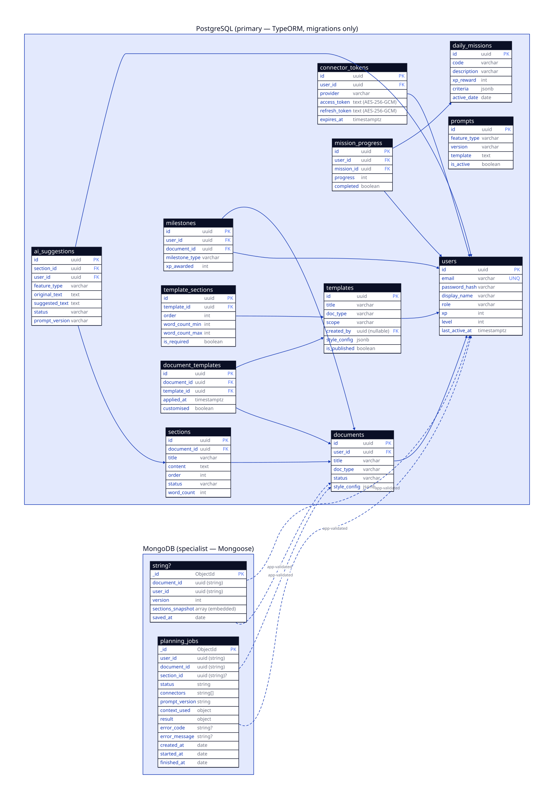

# MemoFlow API

REST API for MemoFlow — users, documents, AI-assisted writing features, and external
connectors. Built with [NestJS 11](https://nestjs.com) on a **dual-database** design:

- **PostgreSQL** (primary) — everything relational, via TypeORM with migrations only.
- **MongoDB** (specialist) — exactly two collections (`document_versions`,
  `planning_jobs`), via Mongoose.
- **Redis** — BullMQ-backed async job queue (AOF persistence), used by the Context
  module's planning-job pipeline.

The full data design lives in [`docs/database-schema.md`](docs/database-schema.md)
(source of truth) and is visualized in
[`docs/diagrams/database-schema.svg`](docs/diagrams/database-schema.svg):



## Quickstart

Prerequisites: Node 24+, Docker (with compose).

```bash
cp .env.example .env   # localhost defaults, works out of the box
npm install
npm run db:up          # postgres:16 + mongo:7 + redis:7 via docker compose
npm run start:dev
```

- Swagger UI: http://localhost:3000/docs
- Health (checks Postgres, MongoDB, and Redis): http://localhost:3000/health

## Commands

| command | what it does |
| --- | --- |
| `npm run start:dev` | dev server with watch (needs DBs up + `.env`) |
| `npm test` / `npm run test:e2e` | unit / e2e tests (e2e: Testcontainers PostgreSQL + in-memory Mongo — needs Docker) |
| `npm run lint` / `npm run build` | lint (with autofix) / compile |
| `npm run db:up` / `db:down` / `db:reset` | local dev databases (`reset` wipes volumes) |
| `npm run db:seed` | idempotent dev seed (refuses to run against staging/production) — creates two dev users, `admin@memoflow.dev` / `writer@memoflow.dev` (password `dev-password-123`) |
| `npm run smoke` | boots the app and polls `/health`; set `SMOKE_BASE_URL` to smoke a deployed environment instead |
| `npm run migration:generate -- src/infrastructure/persistence/migrations/<Name>` | generate migration from entity diff |
| `npm run migration:run` / `migration:revert` / `migration:show` | apply / revert / list migrations |

## Authentication & endpoints

Users live in PostgreSQL. Passwords are hashed with bcrypt; auth uses JWTs issued
via `@nestjs/jwt` and validated by Passport-JWT.

| method | path | auth | notes |
| --- | --- | --- | --- |
| `POST` | `/auth/register` | — | creates a user, returns the user (no password hash) |
| `POST` | `/auth/login` | — | returns `{ accessToken }`; updates `last_active_at` |
| `GET` | `/users/me` | JWT | the authenticated user |
| `GET` | `/users/:id` | JWT | fetch a user by id |
| `POST` | `/documents` | JWT | creates a document owned by the caller |
| `GET` | `/documents` | JWT | lists the caller's documents |
| `GET` | `/documents/:id` | JWT | fetch a document by id, owner-scoped |
| `PATCH` | `/documents/:id` | JWT | partial update, owner-scoped |
| `DELETE` | `/documents/:id` | JWT | owner-scoped; cascades to its sections; returns **204** |
| `POST` | `/documents/:documentId/sections` | JWT | creates a section, appended to the end (`order` server-assigned) |
| `GET` | `/documents/:documentId/sections` | JWT | lists a document's sections, ordered |
| `PATCH` | `/documents/:documentId/sections/reorder` | JWT | reorders sections; body is the full set of section ids in the new order |
| `GET` | `/documents/:documentId/sections/:id` | JWT | fetch a section by id, owner-scoped |
| `PATCH` | `/documents/:documentId/sections/:id` | JWT | partial update (`title`/`content`/`status`); `order` not settable here |
| `DELETE` | `/documents/:documentId/sections/:id` | JWT | owner-scoped; returns **204** |
| `POST` | `/planning-jobs` | JWT | submits a planning prompt; returns **202** + `{ job_id, status: "pending" }` |
| `GET` | `/planning-jobs/:id` | JWT | fetch a planning job by id, owner-scoped |
| `POST` | `/connectors/:provider/connect` | JWT | starts a Composio OAuth connection for a provider; returns `{ redirect_url, connection_id, status }` |
| `GET` | `/connectors` | JWT | lists the caller's connector connections; reconciles any `initiated` connection against Composio first |
| `GET` | `/connectors/:id` | JWT | fetch a connector connection by id, owner-scoped; reconciles if `initiated` |
| `POST` | `/connectors/webhook` | — | Composio-signed webhook (public); updates a connection's status |
| `DELETE` | `/connectors/:id` | JWT | owner-scoped; revokes the Composio connection, sets status `revoked`; returns **204** |

Protected routes require `Authorization: Bearer <accessToken>`. Full request/response
shapes are in Swagger (`/docs`).

### Connectors (OAuth via Composio)

MemoFlow doesn't run per-provider OAuth or store provider tokens itself. **Composio**
is a hosted vault + MCP host: `POST /connectors/:provider/connect` asks Composio for a
connect URL and stores a `connector_connections` row (`composio_account_id`, `status`)
— never an access/refresh token. Response DTOs expose only
`id, provider, status, connected_at, created_at`. Providers are an allowlist (trello,
notion, github). Status transitions to `active` (or `failed`) via a **Composio
webhook** (`POST /connectors/webhook`, public, verified via HMAC over
`webhook-id`/`webhook-timestamp`/`webhook-signature` with `COMPOSIO_WEBHOOK_SECRET`)
as the primary signal, with **reconcile-on-read** as fallback: any `GET /connectors`
or `GET /connectors/:id` on an `initiated` connection re-checks Composio and
self-heals a missed webhook. Terminal states (`revoked`/`failed`) never revive from a
stale webhook. `DELETE /connectors/:id` (JWT, owner-scoped) revokes the connection at
Composio and marks it `revoked`.

When a planning job runs, the worker resolves the user's **active** connectors and
POSTs a `{ provider, mcpUrl: null, composioAccountId }` reference per connector
(built from the local `connector_connections` row, no extra Composio call) to the
external context engine (`CONTEXT_ENGINE_URL`), which resolves the live MCP server
itself from provider + `composioAccountId`. See
[`docs/ROADMAP.md`](docs/ROADMAP.md#7-connectors-oauth-via-composio---done) for
current implementation status.

### Planning jobs (async, real-time over WebSocket)

`POST /planning-jobs` never runs planning synchronously in the request: it writes a
`pending` job to MongoDB (`planning_jobs`) and enqueues it on the Redis/BullMQ
`planning` queue, returning immediately. An in-process worker (`@Processor`) then
picks the job up and processes it through the context-gatherer + LLM-planner ports.
The context-gatherer is real when `CONTEXT_ENGINE_URL` is set: it resolves the
user's active connectors and POSTs them (plus the prompt) to the external context
engine, which fetches and returns the actual context. Leave `CONTEXT_ENGINE_URL`
unset (default in dev/test/e2e) to keep the built-in stub, which echoes the prompt
back. The LLM-planner port is still a stub either way — real model integration
lands with roadmap item 5.

The frontend gets the result pushed in real time over WebSocket (`@nestjs/websockets`
+ socket.io) instead of only polling:

- Connect with the same JWT used for REST, passed in the socket.io handshake as
  `auth.token` (not an `Authorization` header — browsers can't set WS headers). A
  missing or invalid token disconnects the socket immediately.
- Each socket is joined server-side to a room derived from the verified token
  (`user:<id>`) — a client only ever receives events for its own planning jobs.
- Three events relay a job's lifecycle, one terminal event per outcome:
  `planning.status` (`running`), `planning.completed` (with `result`),
  `planning.failed` (with `errorCode`/`errorMessage`).
- After connecting (or reconnecting), emit `subscribe { jobId }` to get that job's
  *current* state immediately — covers a client that connects after the job already
  finished, or reconnects mid-job.

Delivery is **best-effort, at-most-once** — MongoDB `planning_jobs` remains the
durable source of truth. `GET /planning-jobs/:id` stays available as the REST
fallback for clients without a live WebSocket connection. Full request/response and
event shapes are in Swagger (`/docs`).

## Environment variables

Beyond the database connection vars, auth requires:

| var | required | default | notes |
| --- | --- | --- | --- |
| `JWT_SECRET` | yes | — | signing key for access tokens; must be a long random value outside dev |
| `JWT_EXPIRES_IN` | no | `15m` | access token lifetime |
| `REDIS_HOST` | yes | — | Redis host for the BullMQ planning queue |
| `REDIS_PORT` | yes | — | Redis port (`0`–`65535`) |
| `REDIS_PASSWORD` | no | — | Redis auth password, if required |
| `REDIS_TLS` | no | `false` | set `true` for managed TLS-only Redis (e.g. Upstash); local docker Redis stays `false` — mirrors `POSTGRES_SSL` |
| `WS_CORS_ORIGIN` | no | `*` | frontend origin allowed to open the planning WebSocket; `*` is dev-only — must be set explicitly in staging/production, never `*` |
| `COMPOSIO_API_KEY` | yes | — | authenticates this API to Composio (the OAuth vault + MCP host for connectors) |
| `COMPOSIO_BASE_URL` | no | — | override the Composio API base URL (defaults to Composio's hosted endpoint) |
| `COMPOSIO_AUTH_CONFIG_IDS` | yes | — | comma-separated `provider:authConfigId` map, e.g. `trello:ac_...,notion:ac_...` |
| `COMPOSIO_WEBHOOK_SECRET` | yes | — | HMAC secret used to verify `POST /connectors/webhook` signatures from Composio |
| `CONTEXT_ENGINE_URL` | no | — | base URL of the external context engine; unset keeps the planning worker on the built-in stub context-gatherer |
| `CONTEXT_ENGINE_API_KEY` | no | — | sent as `Authorization: Bearer <key>` on context-engine requests, when set |
| `CONTEXT_ENGINE_TIMEOUT_MS` | no | `10000` | aborts the context-engine POST after this many ms, failing the planning job fast instead of hanging |

See [`.env.example`](.env.example) for the full list (`NODE_ENV`, `PORT`,
`MONGODB_URI`, `POSTGRES_*`).

## Architecture

Clean architecture: each feature is a vertical slice across four layers —
`src/domain` (entities + repository interfaces), `src/application` (use-cases),
`src/infrastructure/persistence` (TypeORM/Mongoose implementations — the only layer
that touches a database library), and `src/presentation` (controllers + validated
DTOs). Shared plumbing (exception filter, logging, health) lives in `src/shared`;
env validation in `src/config`.

## Branching & environments (gitflow)

| branch | environment | role |
| --- | --- | --- |
| `main` | production | releases only, tagged |
| `staging` | staging | pre-production validation (release-branch role) |
| `development` | dev | integration — all feature PRs target this |

Work happens on `feature/<slug>` / `bugfix/<slug>` branches off `development`
(`hotfix/<slug>` off `main`); promotion is one-way via PR:
`development` → `staging` → `main`. Database migrations are applied per environment
at deploy time — `synchronize` is always off.

### Branch naming & PR templates

Branch names follow Conventional-Commit types: **`<type>/<slug>`**.

| type | for | base branch |
| --- | --- | --- |
| `feat` | new feature | `development` |
| `fix` | bug fix | `development` |
| `hotfix` | urgent production fix | `main` (back-merged to `staging` + `development`) |
| `docs` | documentation only | `development` |
| `refactor` | behaviour-preserving restructure | `development` |
| `perf` | performance improvement | `development` |
| `test` | tests only | `development` |
| `build` | build system / dependencies | `development` |
| `ci` | CI/CD pipeline | `development` |
| `chore` | tooling / maintenance | `development` |
| `style` | formatting only | `development` |

`slug` is kebab-case (`[a-z0-9._-]+`), e.g. `feat/user-auth`, `fix/token-expiry`.

**Enforcement**

- **CI** — `.github/workflows/branch-naming.yml` fails any PR whose source branch
  doesn't match the convention. Long-lived branches (`development`, `staging`, `main`)
  are exempt so promotion PRs pass.
- **Local** — a `pre-push` hook rejects non-conventional branch names before they leave
  your machine. Install it once per clone:

  ```bash
  bash scripts/install-hooks.sh
  ```

**PR templates** — each type has its own template under
`.github/PULL_REQUEST_TEMPLATE/`. Pick one when opening a PR:

```bash
gh pr create --template feat.md      # or fix.md, hotfix.md, docs.md, ...
```

Or add `?template=feat.md` to the compare URL. Opening a PR without choosing one loads
the default `.github/PULL_REQUEST_TEMPLATE.md`.

## CI/CD

GitHub Actions (`.github/workflows/`):

- `ci.yml` — on every PR to `development`/`staging`/`main`: lint, build, unit tests,
  e2e tests (Testcontainers PostgreSQL + in-memory Mongo; hard-fails if the e2e
  Docker suite would skip).
- `deploy-dev.yml` — on push to `development`: run migrations, trigger a Render
  deploy hook, then smoke-check via `scripts/smoke.sh`. Gated by the GitHub
  Environment `development`.
- `notify-review.yml` — on a PR to `development`/`staging`/`main` being opened or
  marked ready for review (non-draft only): posts the PR recap to Discord and pings
  a reviewer role.

### CI secrets

These are **GitHub Actions secrets**, not application env vars — they are consumed
only inside workflow runs and must not be added to `.env.example`.

| secret | purpose |
| --- | --- |
| `DISCORD_WEBHOOK_URL` | Incoming webhook URL for the reviewer channel (`notify-review.yml`). |
| `DISCORD_REVIEWER_ROLE_ID` | Numeric Discord role id pinged when a PR is ready for review (`notify-review.yml`). |

If either is unset, `notify-review.yml` soft-skips (a `::warning::`, no failure) —
it never blocks the PR.

The `development` tier deploys to **Render** (see [`render.yaml`](render.yaml) for the
web service + managed Postgres blueprint). Render has no managed MongoDB, so dev
MongoDB is an external **MongoDB Atlas M0 (free tier)** instance, with its connection
string set manually as the `MONGODB_URI` secret. Render also has no managed free
Redis, so dev Redis is likewise external — **Upstash free tier**, TLS-only
(`REDIS_TLS=true`) — with `REDIS_HOST` / `REDIS_PORT` / `REDIS_PASSWORD` set manually
as secrets. Staging and production deploy targets are not yet decided.

## Documentation

- [`ARCHITECTURE.md`](ARCHITECTURE.md) — system architecture: service topology,
  module boundaries, and shared infrastructure (including the Context module's
  bounded async backbone and future extraction triggers).
- [`docs/database-schema.md`](docs/database-schema.md) — authoritative data design
  (tables, collections, indexes, which database each entity lives in).
- [`docs/ROADMAP.md`](docs/ROADMAP.md) — feature roadmap with per-item specs and
  current status.
- [`docs/diagrams/`](docs/diagrams/) — diagrams authored in
  [D2](https://d2lang.com) (`.d2` sources) with rendered SVGs committed alongside.
  Regenerate with `d2 <name>.d2 <name>.svg`.
